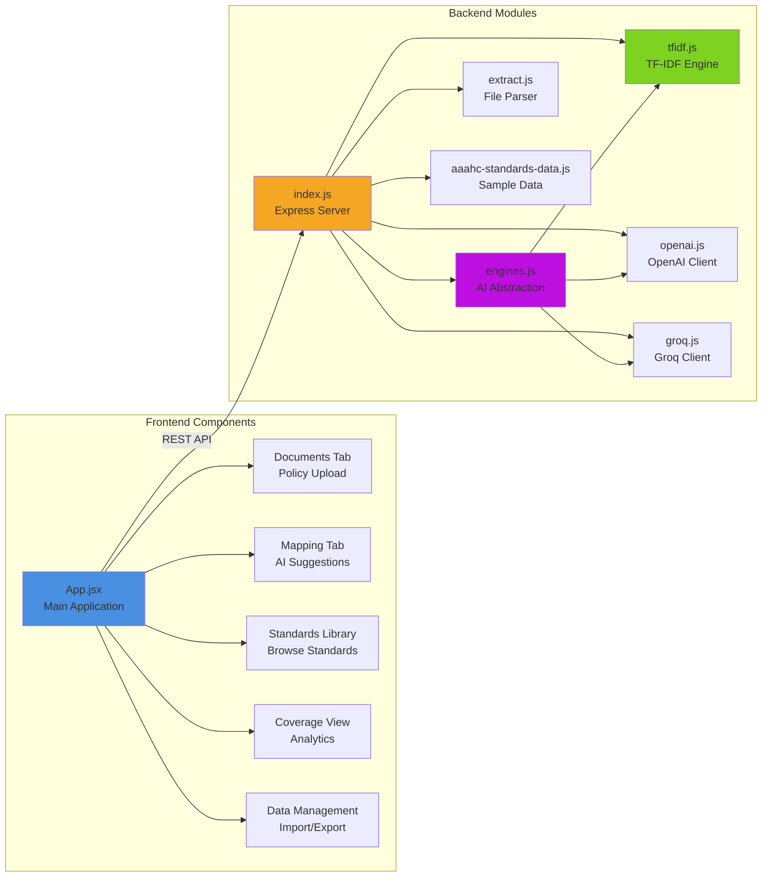
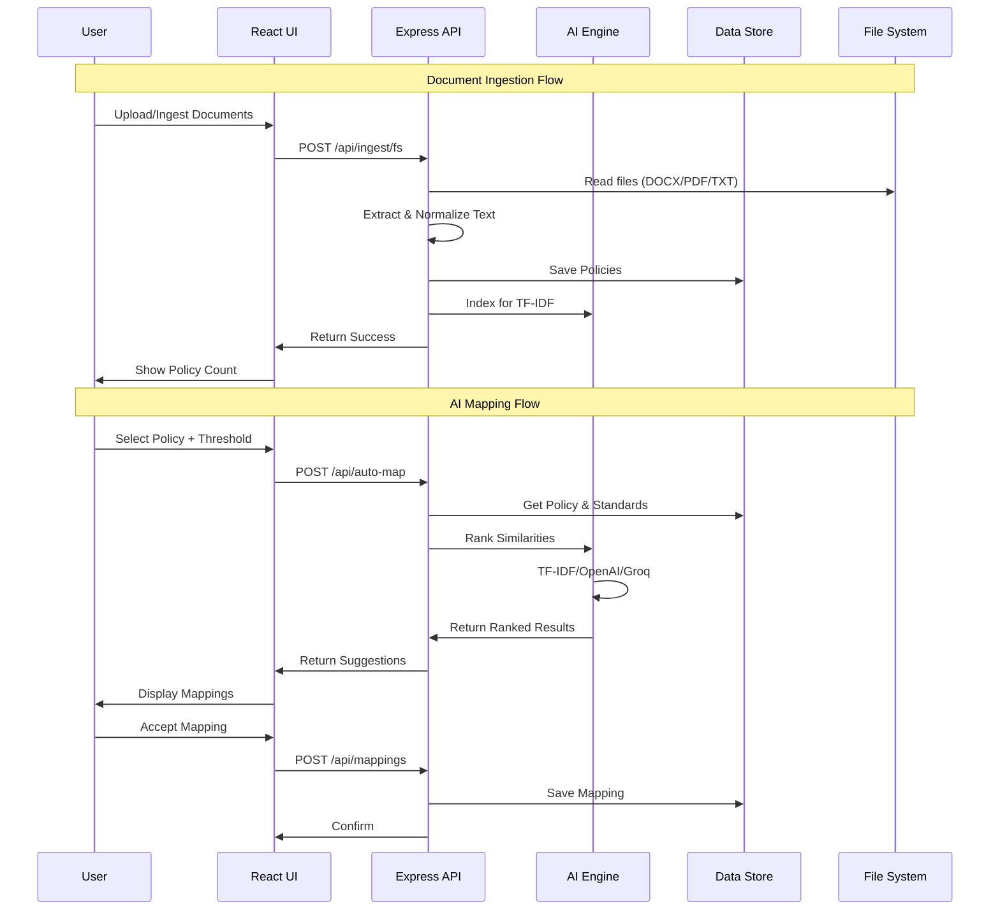
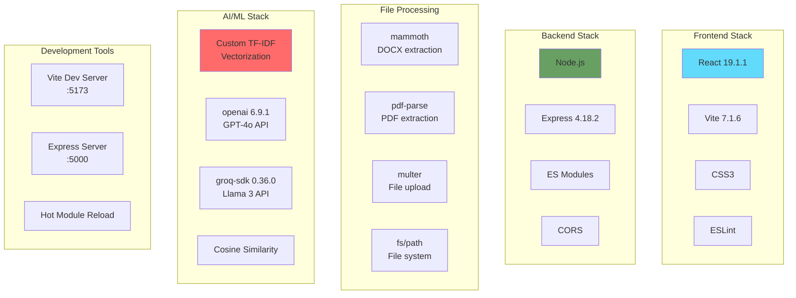
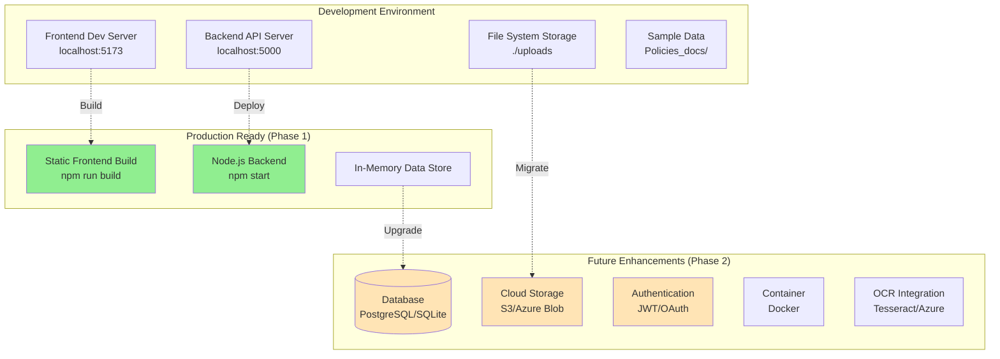
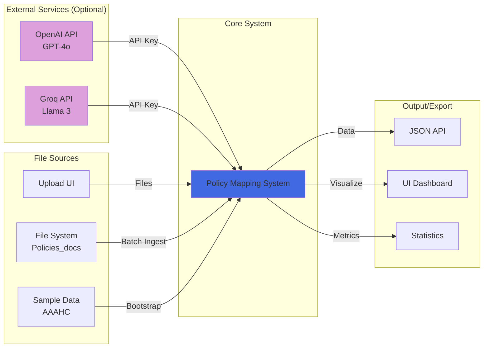
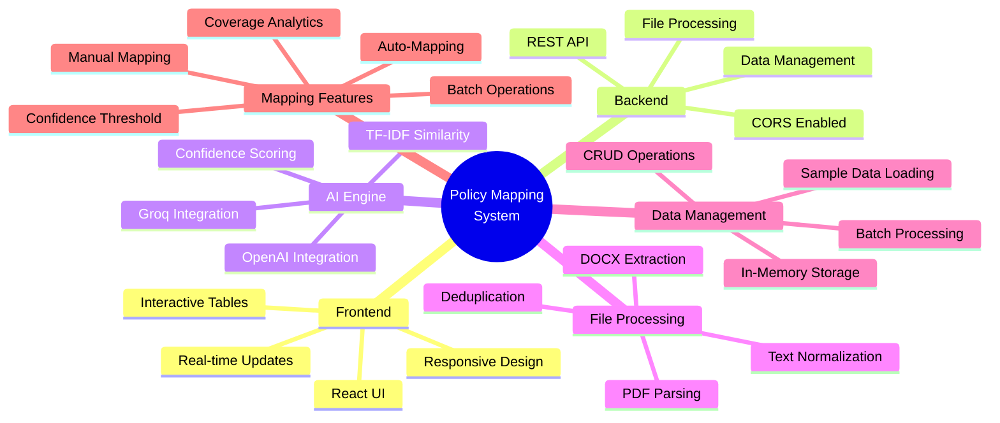
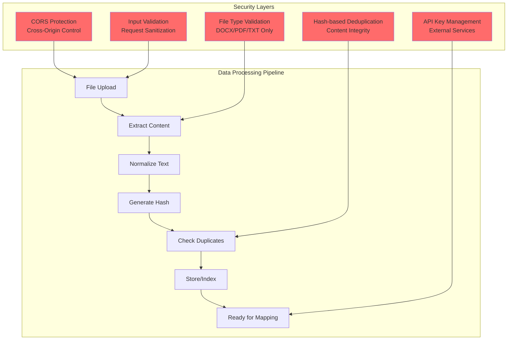

# System Architecture Diagram

## High-Level Architecture

```mermaid
graph TB
    subgraph "Client Layer (Frontend)"
        UI[React UI - Vite]
        UI_TABS[UI Components]
        UI_TABS --> DOCS[Documents Tab]
        UI_TABS --> MAP[Mapping Tab]
        UI_TABS --> LIB[Standards Library]
        UI_TABS --> COV[Coverage View]
        UI_TABS --> DATA[Data Management]
    end

    subgraph "API Layer (Backend)"
        API[Express Server :5000]
        API --> ROUTES[REST API Routes]
        ROUTES --> POL_API[Policies API]
        ROUTES --> STD_API[Standards API]
        ROUTES --> MAP_API[Mappings API]
        ROUTES --> AI_API[AI/Auto-Map API]
        ROUTES --> FILE_API[File Processing API]
    end

    subgraph "AI Engine Layer"
        ENGINE[Engine Manager]
        ENGINE --> TFIDF[TF-IDF Engine<br/>Fast, Keyword-based]
        ENGINE --> OPENAI[OpenAI GPT-4o<br/>Reasoning-based]
        ENGINE --> GROQ[Groq Llama 3<br/>Fast & Free]
        TFIDF --> VECTOR[Vectorization]
        TFIDF --> COSINE[Cosine Similarity]
    end

    subgraph "File Processing Layer"
        EXTRACT[Document Extractor]
        EXTRACT --> DOCX[DOCX Parser<br/>mammoth]
        EXTRACT --> PDF[PDF Parser<br/>pdf-parse]
        EXTRACT --> TXT[TXT/MD Parser<br/>fs]
        EXTRACT --> NORM[Text Normalization]
        EXTRACT --> DEDUPE[Deduplication<br/>Hash-based]
    end

    subgraph "Data Storage Layer (In-Memory Phase 1)"
        STORE[Data Store]
        STORE --> POL_STORE[(Policies<br/>589 docs)]
        STORE --> STD_STORE[(Standards<br/>AAAHC)]
        STORE --> MAP_STORE[(Mappings<br/>AI + Manual)]
        STORE --> SUBMAP_STORE[(Sub-Standard<br/>Mappings)]
    end

    subgraph "File System"
        FS[Local Files]
        FS --> UPLOAD[Uploads Directory]
        FS --> POLICY_DOCS[Policies_docs<br/>Directory]
    end

    UI -->|HTTP/JSON| API
    API -->|Query/Rank| ENGINE
    API -->|Extract Content| EXTRACT
    API -->|CRUD Operations| STORE
    EXTRACT -->|Read Files| FS
    API -->|Store Files| FS
    ENGINE -->|Index/Search| STORE
    
    style UI fill:#e1f5ff
    style API fill:#fff4e1
    style ENGINE fill:#f0e1ff
    style EXTRACT fill:#e1ffe1
    style STORE fill:#ffe1e1
    style FS fill:#f5f5f5
```



## Detailed Component Architecture



## Data Flow Architecture



## Technology Stack



## Deployment Architecture



## System Integration Points



## Key Features Architecture



## Security & Data Flow



## API Endpoint Architecture

```mermaid
graph LR
    API[Express API<br/>localhost:5000]
    
    subgraph "Core Data Endpoints"
        POL[/api/policies<br/>GET, POST]
        STD[/api/standards<br/>GET, POST]
        MAP[/api/mappings<br/>GET, POST, DELETE]
        SUB[/api/sub-mappings<br/>GET, POST, DELETE]
    end
    
    subgraph "AI Endpoints"
        AUTO[/api/auto-map<br/>POST]
        BATCH[/api/auto-map/batch<br/>POST]
        ENG[/api/engines<br/>GET, POST]
    end
    
    subgraph "File Processing Endpoints"
        UP[/api/policies/upload<br/>POST]
        ING[/api/ingest/fs<br/>POST]
        PROC[/api/standards/process-pdf<br/>POST]
        TXT[/api/standards/process-txt<br/>POST]
    end
    
    subgraph "Utility Endpoints"
        STAT[/api/stats<br/>GET]
        RESET[/api/reset<br/>POST]
        SAMPLE[/api/standards/sample<br/>POST]
        COV[/api/standards/coverage<br/>GET]
    end
    
    API --> POL
    API --> STD
    API --> MAP
    API --> SUB
    API --> AUTO
    API --> BATCH
    API --> ENG
    API --> UP
    API --> ING
    API --> PROC
    API --> TXT
    API --> STAT
    API --> RESET
    API --> SAMPLE
    API --> COV
    
    style API fill:#f5a623
    style AUTO fill:#bd10e0
    style BATCH fill:#bd10e0
```

---

## Summary

This architecture represents a modern full-stack healthcare policy management system with the following key characteristics:

### Current State (Phase 1)
- **Frontend**: React + Vite with interactive UI components
- **Backend**: Node.js + Express REST API
- **AI Engine**: TF-IDF similarity with pluggable architecture (OpenAI, Groq)
- **Storage**: In-memory data structures
- **File Processing**: DOCX/PDF/TXT extraction and normalization
- **Status**: ✅ Fully functional with 589 policies ingested

### Future Enhancements (Phase 2)
- Database persistence (PostgreSQL/SQLite)
- Cloud storage integration
- Advanced embeddings (transformers, sentence-BERT)
- User authentication and authorization
- OCR for scanned documents
- Export functionality (CSV, reports)
- Analytics dashboard
- Containerization (Docker)

### Key Strengths
1. **Modular Architecture**: Clean separation of concerns
2. **Pluggable AI**: Easy to swap between TF-IDF, OpenAI, and Groq
3. **Extensible Design**: Ready for Phase 2 enhancements
4. **Full-Stack**: Complete end-to-end solution
5. **Developer-Friendly**: Hot reload, clear API structure, comprehensive documentation
